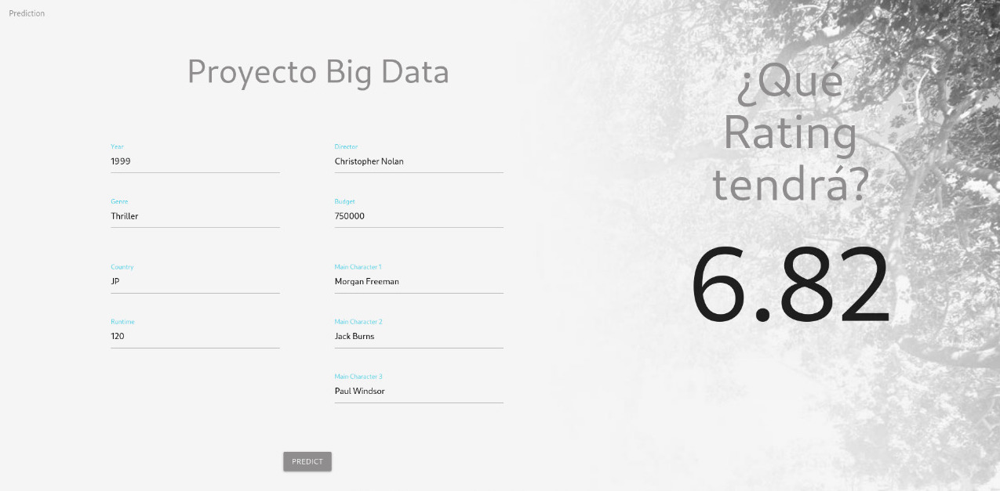

# Movie Rating Prediction

Project for Big Data at UTEC. Presentation [here](https://docs.google.com/presentation/d/1lMhDmHDZAS_NrdqU6orxWSsjgNQPyscWWQmStcVh2TY/edit?usp=sharing).


#### Team

* Jonathan Loza
* Jorge Rios
* Andrea Velásquez

## Workflow

### 0. Sources

#### MovieLens (CSV)

From https://grouplens.org/datasets/movielens/25m/

**Total: 651 MB**

* ratings.csv (25 000 095 rows): Users ratings **(646.8MB)**
* movies.csv (62423 rows): Movies IDs and titles **(2.9MB)**
* links.csv (62 423 rows): IMDb and TMDB IDs **(1.3MB)**

#### IMDb (CSV)

From https://www.imdb.com/interfaces/

**Total: 3.12 GB**

* name.basics (10 370 999 rows): Director **(601.7MB)**
* title.basics (7 176 289 rows): Year, genre **(603.8MB)**
* title.crew (7 176 298 rows): Director id **(228.2MB)**
* title.principals: Main cast **(1.7GB)**
* title.ratings (1 074 000 rows) : Average rating **(17.9MB)**

#### Rotten Tomatoes (Web Scrapping)

From https://www.rottentomatoes.com/m/{movie}

* Tomatometer
* Audience score

#### The Movie DB (TMDB) (API)

From https://api.themoviedb.org/3/movie/{tmdb_id}?api_key={api_key}

* Runtime
* Country
* Budget

### 1. Data Extraction

The directory `data-extraction/` contains the script for each source.

* IMDb: Hive, HDFS and Google Cloud. Hive queries can be found in the directory.
* MovieLens: A map-reduce job and a spark job scheduled in the cluster to get updated ratings.
* Rotten Tomatoes: Two spiders in Scrapy: `MoviesSpider.py` and `MoviesRetrySpider.py` to retry 403 errors.
* TMDB: Requests to the API

### 2. Model

The Jupyter Notebook `model/model.ipynb` contains a detailed explanation of the models. Three models were tested: ElasticNet, Lasso and SGDRegressor (first two had a similar and better performance than the last one).

### 3. Dashboard

The directory `dashboard` contains the backend and frontend code of the dashboard.

#### Backend

 [Cortex](https://docs.cortex.dev/v/0.18/) was used to provide the model to the frontend through an API.

```bash
cd dashboard/backend
bash -c "$(curl -sS https://raw.githubusercontent.com/cortexlabs/cortex/0.18/get-cli.sh)"
cortex deploy # API deployed at http://localhost:8888
```

#### Frontend

The frontend was made with React.

```bash
cd dashboard/frontend
npm i
npm run start
```



